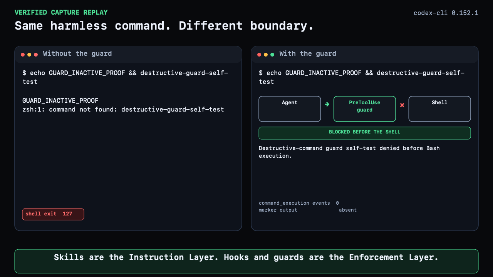
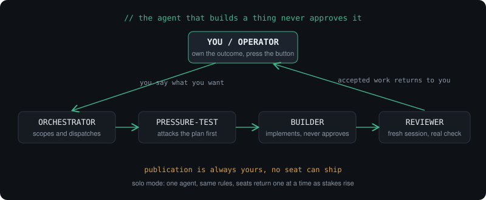

# governed-agent-skills

**Instructions guide the work. Guards check what judgment should not decide.**

[](LICENSE)
[](#install-the-instruction-layer-as-a-claude-code-plugin)
[](https://github.com/Ezra144israel/governed-agent-skills/actions/workflows/security.yml)


Version 4 has two layers. The **Instruction Layer** is six skills that tell
coding agents how to work. The **Enforcement Layer** is two standalone guards
that check the parts that should not depend on judgment.

The layers work together, but they are installed separately. The plugin installs
only the six skills. It does not install, wire, or activate either guard. Not
every skill needs a guard. Add enforcement only where a rule can be checked
mechanically and the cost of a miss matters.

[](https://ezra144israel.github.io/governed-agent-skills/#live-proof)

[Watch the 50-second guard proof](https://ezra144israel.github.io/governed-agent-skills/#live-proof),
read its [transcript](assets/destructive-command-guard/destructive-command-guard-transcript.md),
or inspect the [machine-readable evidence](demo/destructive-command-guard/evidence/public-evidence.json).
This candidate contains one sterile Codex receipt. Older maintainer records for
Claude Code and Antigravity are separate observations.



Full picture, including when each skill loads:
[**how it works, live page**](https://ezra144israel.github.io/governed-agent-skills/).

Built and maintained by [Ezra Israel](https://github.com/Ezra144israel) · [X](https://x.com/Eisrael144).

## Who this is for, and who it isn't

These skills were built to govern teams of coding agents: agents that
write code, review each other's work, and change repositories. That is
where the constitution and independent review earn their keep, when an
agent's mistake can reach a codebase, a deploy, or a canonical record.

If your agents do other work, such as marketing copy, listings, research,
design, or operations, most of this package is heavier than you need.
Take `reasoning-doctrine` (the working method: verify before asserting,
never build on unconfirmed facts, and catch drift on long tasks. It applies
to any kind of work) and leave the constitution until
the day your agents touch real code.

An honest scope statement beats a broad one. If you install only one
skill from this repo, install `reasoning-doctrine`.

## What a "seat" is

A seat is a role an AI agent occupies for one session. It is not a person,
and not a job title. The humans in your life are not seats. You, the
human, are the operator: the one who owns the outcome, makes the
decisions, and says what "done" means. Every seat is filled by an
agent working for you.

Any agent can fill any seat: Claude, ChatGPT, Codex, Gemini, a local
model, whatever you use. The same product can even fill two seats,
as long as it's two separate sessions with separate context. What
matters is never which vendor sits down. The agent that
BUILT a thing is not the agent that APPROVES it.

A concrete day with one person and two agents:

1. You tell an agent what you want (you = operator, it drafts the
   plan = orchestrator seat).
2. A second agent, or just a fresh session of the first, attacks
   the plan before anything is built (pressure-test seat).
3. An agent implements it (builder seat). It never approves its own
   work and never publishes.
4. A different session reviews the result against the plan
   (reviewer seat) and returns accepted / needs revision / blocked.
5. You verify it works on the real surface, and you press the
   button that ships it. Publication is always yours.

Solo mode: with one person and one agent, the constitution collapses
to "operating solo: owner + orchestrator", with no ceremony, and
low-stakes work passes on an honest, labelled self-check. The seats
come back one at a time as the stakes rise: the first one worth
adding is a fresh-session reviewer for anything you'd hate to ship
broken.

Why bother? Because an agent grading its own homework misses the
same things twice. Seat separation is the cheapest independent
check that exists: it costs one extra session.

## Instruction Layer

These six skills define the working method, roles, planning discipline,
implementation lens, test evidence, and maximum-assurance review cycle.

| Skill | What it does | Files |
|---|---|---|
| `skills/reasoning-doctrine/` | Stops drift. Frame, ground, converge, execute, verify. Every task. | `SKILL.md` + 4 references |
| `skills/governed-operator/` | The constitution. Seats, gates, and one rule above all: the builder never approves its own work. | `SKILL.md` |
| `skills/write-maintainable-code/` | The smallest change that truly does the job. Nothing speculative survives. | `SKILL.md` |
| `skills/portable-adaptive-planning/` | A plan is not permission. FINAL, then GO, and nothing runs without both. | `SKILL.md` + 1 reference |
| `skills/test-verification/` | Tests prove behavior, not internals. Green is not proof. | `SKILL.md` + 1 reference |
| `skills/ship-it-or-fix-it/` | On your say-so only. The acceptance oracle freezes before the code exists. | `SKILL.md` |

### Supported installation units

Skills install individually. Their installation units, in package order, are:

- `reasoning-doctrine` works alone.
- `governed-operator` requires `reasoning-doctrine`.
- `write-maintainable-code` works alone.
- `portable-adaptive-planning` works alone.
- `test-verification` works alone.
- `ship-it-or-fix-it` requires `governed-operator`, `reasoning-doctrine`, and
  `test-verification`.
- the full six-skill package.

## Enforcement Layer

These guards are working code, not skills. Install and wire each one manually.
Cloning this repository or installing the plugin activates neither guard.

| Guard | Purpose |
|---|---|
| [`destructive-command-guard/`](destructive-command-guard/) | Python pre-execution hook that denies a narrow set of catastrophic shell commands. It has no third-party dependencies. Its safe sentinel proves that the hook runs on a live surface. |
| [`change-containment-guard/`](change-containment-guard/) | Rust final-state guard that seals allowed change classes, then rejects unclassified changes and stale verification receipts. Version 4 ships source only. Build, copy, and hook wiring are separate manual steps. |

Read each guard's README for technical details, verified support, limits, and
installation. The root README stays short so those facts have one source of
truth.

The [`Security checks`](.github/workflows/security.yml) badge means the named
checks passed for that revision. It does not mean malware-free, complete audit
coverage, safe live wiring, or guaranteed behavior. See [SECURITY.md](SECURITY.md).

## Use the Instruction Layer

Two modes. Both work. Pick one per surface.

1. **Manual invoke** (default, zero setup): copy the skill directories into
   your agent's skills folder and invoke by name, or let the agent match on
   the skill descriptions. See [INSTALL.md](INSTALL.md).
2. **Progressive loading** (optional): route skills conditionally at session
   start with a small router and an `AGENTS.md` shim, so each skill loads
   only when its trigger fires. See [activation/](activation/) for example
   files. Nothing activates when you clone this repo.

Recommended load order: `reasoning-doctrine` on any nontrivial task. Add
`governed-operator` (it requires the method) before governed work.
`write-maintainable-code` after the outcome, acceptance evidence, scope, and
authority are fixed. Use `test-verification` when tests are written or
reviewed. `ship-it-or-fix-it` loads only on your explicit
maximum-assurance decision, never on task class alone. Independent review
follows the change.

## Install the Instruction Layer as a Claude Code plugin

```
/plugin marketplace add Ezra144israel/governed-agent-skills
/plugin install governed@ezra-governed
```

Skills load namespaced (for example `/governed:reasoning-doctrine`). Manual
installation, copying `skills/*` into `~/.claude/skills/`, works exactly
the same. The plugin installs only the six skills. It does not install, wire,
or activate the Enforcement Layer guards. See [INSTALL.md](INSTALL.md).

## Install the Instruction Layer in other agents

This repo also ships an [Agent Plugins](https://agent-plugins.org) manifest.
Route status is updated as surfaces are run in practice, not on
documentation:

- **Claude Code** (plugin route): verified in practice for v2.
- **GitHub Copilot CLI** (direct repo install): verified in practice on v1.x.
  not yet re-run on v2. Current CLI builds mark direct repo installs as
  deprecated. A marketplace-based route may be required in future versions.
- **VS Code** (Agent Plugins install): plugin installs and its skills list
  correctly on v1.x. Chat-side invocation could not be attributed to the
  plugin. Not yet re-run on v2.
- **Codex / ChatGPT desktop, Cursor**: documented by their vendors, not yet
  run by the maintainer.
- **Manual copy** (folders under `skills/` into your agent's skills
  directory): verified in practice on Antigravity and Kimi on v2 with exact
  byte-matched installs. Grok on v2 lists and parses all six skills of that
  version. Full body readback is not confirmed there.

Confirmations and failure reports on any route are welcome.

A note on what "verified" covers: skills are invoked when a request matches
their description. They are not command-level enforcement. For hard blocking
of destructive commands, see
[destructive-command-guard/](destructive-command-guard/).

Guard installation is separate on every surface. See the
[Enforcement Layer install routes](INSTALL.md#enforcement-layer).

**GitHub Copilot CLI:**

```
copilot plugin install Ezra144israel/governed-agent-skills
```

**VS Code (Copilot):** enable the `chat.plugins.enabled` setting, then Command
Palette → "Chat: Install Plugin From Source" → paste this repo's URL. (Preview
feature. Your organization may disable it.)

**Cursor CLI:** run `agent`, then `/plugin`, paste this repo's URL, choose scope.

**Codex / ChatGPT desktop:**

```
codex plugin marketplace add Ezra144israel/governed-agent-skills
```

then `/plugins` → source "ezra-governed" → install "governed" → start a new
session.

**Cursor desktop and ChatGPT web:** not yet directly installable, because
these require marketplace/directory listing. Until then, manual install works
everywhere: copy any folder under `skills/` into your agent's skills
directory, respecting the installation units above.

## Credits

The repository's editing process drew on `grilling` from
[mattpocock/skills](https://github.com/mattpocock/skills) and `unslop` from
[cursor/plugins](https://github.com/cursor/plugins) by Lauren Tan. Both are
MIT-licensed. Neither skill is included or distributed here.

## License

MIT
